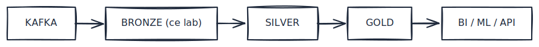
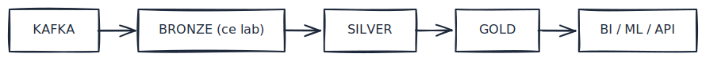

# Lab L5 — PySpark Structured Streaming → Bronze layer Delta
**Durée** : 2h
**Stack** : PySpark 3.5, Kafka, Delta Lake 3.1, MinIO (S3), Schema Registry

> **Cours associé** : M9.2 — Lab Kafka → Bronze et M9.3 — File streaming. Les fichiers `setup_spark.py`, `read_kafka_raw.py`, `write_bronze_delta.py` de ce lab sont **réutilisés et adaptés** par M9.2 au cas `orders.valid` JSON.
> **Paire bilingue** : [L6-scala-spark-streaming](../../labs/L6-scala-spark-streaming/lab.md) — même contenu en Scala. Faire **L5 ou L6** selon le langage cible (L5 = défaut pédagogique, plus accessible).

## Objectifs

À la fin de ce lab, vous serez capable de :

- Connecter PySpark à Kafka via le connecteur `spark-sql-kafka-0-10`.
- Désérialiser un message Avro produit par Schema Registry (Confluent wire format).
- Écrire en streaming dans une table **Delta Lake** sur MinIO (S3-compatible) — couche **bronze** de l'architecture médaillon.
- Maîtriser les bases : `Trigger.ProcessingTime` vs `Trigger.AvailableNow`, `checkpointLocation`, `outputMode`, watermarks.
- Comprendre comment ce que vous écrivez dans `s3a://bronze/orders/` est **exactement le bronze layer décrit dans T4 §3.2** (raw, append, point d'entrée du lakehouse).

## Prérequis

- Lab **L1** réalisé (cluster Kafka + Schema Registry + MinIO + Spark cluster up).
- Lab **L4** réalisé : les topics CDC `ecommerce.public.orders`, `ecommerce.public.customers`, `ecommerce.public.order_items` sont alimentés par Debezium.
- Module théorique **T4** lu, en particulier §3 (architecture médaillon) et §4 (moteurs de streaming).
- Python 3.11 et Java 11+ installés sur l'hôte (PySpark embarque le moteur Spark, mais a besoin d'une JVM).

## Architecture

Pipeline cible du lab :

<!-- mermaid-source
%%{init: {'theme':'base', 'themeVariables': {'primaryColor':'#1F2937','primaryTextColor':'#F9FAFB','primaryBorderColor':'#374151','lineColor':'#6366F1','fontFamily':'Inter, system-ui, sans-serif','fontSize':'14px'}}}%%
flowchart LR
    PG["Postgres<br/>(L4)"] --> DBZ["Debezium CDC<br/>connector"]
    DBZ --> K["Kafka topics<br/>ecommerce.public.*"]
    SR["Schema Registry<br/>(Avro)"] -.-> K
    K --> SP["PySpark Structured<br/>Streaming<br/>readStream + from_avro"]
    SP --> CKP[("Checkpoint<br/>s3a://bronze/_checkpoints")]
    SP --> B[("BRONZE<br/>s3a://bronze/orders/<br/>format Delta")]
    classDef kafka fill:#0EAA47,stroke:#0E7C32,color:#fff,stroke-width:2px
    classDef bronze fill:#CD7F32,stroke:#8B5A2B,color:#fff,stroke-width:2px
    classDef source fill:#3B82F6,stroke:#1E40AF,color:#fff,stroke-width:2px
    classDef registry fill:#F59E0B,stroke:#B45309,color:#fff,stroke-width:2px
    classDef compute fill:#EC4899,stroke:#BE185D,color:#fff,stroke-width:2px
    classDef storage fill:#14B8A6,stroke:#0F766E,color:#fff,stroke-width:2px
    class PG,DBZ source
    class K kafka
    class SR registry
    class SP compute
    class B bronze
    class CKP storage
-->

<!-- mermaid-source
flowchart LR
    PG["Postgres (L4)"] --&gt; DBZ["Debezium CDC"]
    DBZ --&gt; K["Kafka topics<br/>ecommerce.public.*"]
    SR["Schema Registry"] -.-> K
    K --&gt; SP["PySpark Structured<br/>Streaming"]
    SP --&gt; CKP[("Checkpoint<br/>s3a://bronze/_checkpoints")]
    SP --&gt; B[("BRONZE<br/>s3a://bronze/orders/")]
-->

[Source Excalidraw](../../figures/L5/02.excalidraw)

Zoom sur la place du bronze dans le médaillon (cf. T4 §3.2) :

<!-- mermaid-source
%%{init: {'theme':'base', 'themeVariables': {'primaryColor':'#1F2937','primaryTextColor':'#F9FAFB','primaryBorderColor':'#374151','lineColor':'#6366F1','fontFamily':'Inter, system-ui, sans-serif','fontSize':'14px'}}}%%
flowchart LR
    K["KAFKA<br/>(point d'entrée)"] --> B["BRONZE<br/>raw, append-only<br/>s3a://bronze/<br/><b>↑ ce lab</b>"]
    B --> S["SILVER<br/>clean, conform<br/>(challenge L5)"]
    S --> G["GOLD<br/>business ready<br/>(L7)"]
    G --> CONS["BI / ML / API"]
    classDef kafka fill:#0EAA47,stroke:#0E7C32,color:#fff,stroke-width:2px
    classDef bronze fill:#CD7F32,stroke:#8B5A2B,color:#fff,stroke-width:2px
    classDef silver fill:#C0C0C0,stroke:#8C8C8C,color:#1F2937,stroke-width:2px
    classDef gold fill:#FFD700,stroke:#B8860B,color:#1F2937,stroke-width:2px
    classDef bi fill:#8B5CF6,stroke:#6D28D9,color:#fff,stroke-width:2px
    class K kafka
    class B bronze
    class S silver
    class G gold
    class CONS bi
-->

<!-- mermaid-source
flowchart LR
    K["KAFKA"] --&gt; B["BRONZE (ce lab)"]
    B --&gt; S["SILVER"]
    S --&gt; G["GOLD"]
    G --&gt; CONS["BI / ML / API"]
-->

[Source Excalidraw](../../figures/L5/04.excalidraw)

> Lien T4 explicite : la table que vous allez écrire dans `s3a://bronze/orders/` est **exactement** le bronze layer dont parle T4 §3.2 — append-only, schéma préservé tel quel, fidèle à la source, jamais retouché manuellement. Le silver et le gold se construiront par-dessus dans les labs suivants (challenge en fin de lab + L7).

## Étape 1 — Setup PySpark local + dépendances

On installe PySpark côté hôte (le cluster Spark Docker reste disponible si vous voulez ensuite déployer le job avec `spark-submit --master spark://localhost:7077`).

```bash
cd labs/L5-pyspark-streaming
python -m venv .venv && source .venv/bin/activate
pip install -r requirements.txt
```

Vérifier la JVM :

```bash
java -version   # 11+ requis
```

> Au premier run, Spark va télécharger les packages Maven (Kafka connector, spark-avro, Delta, hadoop-aws). Cela prend ~1-2 minutes et nécessite un accès réseau. Les JARs sont aussi pré-téléchargés dans `docker/spark/jars/` pour les jobs lancés sur le cluster Spark Docker.

## Étape 2 — Spark session avec config Kafka + Delta + S3 (MinIO)

Toute la configuration vit dans `setup_spark.py`. Elle déclare :

- les **packages** : `spark-sql-kafka-0-10`, `spark-avro`, `delta-spark`, `hadoop-aws`,
- l'**extension Delta** (`spark.sql.extensions=io.delta.sql.DeltaSparkSessionExtension`) et le **catalog** Delta,
- la **config S3A pour MinIO** : endpoint `http://localhost:9000`, credentials `minioadmin`, `path.style.access=true`, `connection.ssl.enabled=false`.

Smoke test :

```bash
python setup_spark.py
# Spark version : 3.5.0
# Master         : local[2]
```

Si la commande échoue avec `java.lang.NoClassDefFoundError`, c'est qu'Ivy n'a pas pu télécharger un package — vérifier la connectivité ou ajouter manuellement les JARs dans `~/.ivy2/jars`.

## Étape 3 — readStream depuis Kafka, premier collect

Premier sanity check : lire le topic CDC en string brut et imprimer 30 secondes.

```bash
python read_kafka_raw.py
```

Le code clé :

```python
df = (spark.readStream
    .format("kafka")
    .option("kafka.bootstrap.servers", "localhost:9092,localhost:9093,localhost:9094")
    .option("subscribe", "ecommerce.public.orders")
    .option("startingOffsets", "earliest")
    .load())
```

Le DataFrame Kafka expose 7 colonnes standard : `key`, `value` (binary), `topic`, `partition`, `offset`, `timestamp`, `timestampType`. La valeur est binaire — on ne va pas la décoder en string très longtemps puisque, ici, c'est de l'Avro Confluent.

## Étape 4 — Désérialiser Avro (binaire → struct)

Avec Schema Registry (cas de L4), chaque payload est préfixé par 5 octets : `0x00` (magic byte) + 4 octets contenant l'`id` du schéma. Il faut **les retirer** avant `from_avro` :

```python
from pyspark.sql.functions import col, expr
from pyspark.sql.avro.functions import from_avro

with open("schemas/order_v1.avsc") as f:
    schema_str = f.read()

avro_payload = expr("substring(value, 6, length(value) - 5)")

decoded = df.select(
    col("key").cast("string").alias("key"),
    from_avro(avro_payload, schema_str).alias("order"),
    col("topic"), col("partition"), col("offset"),
    col("timestamp").alias("kafka_ts"),
).select(
    "key",
    col("order.__op").alias("op"),
    col("order.__ts_ms").alias("cdc_ts_ms"),
    col("order.*"),
    "topic", "partition", "offset", "kafka_ts",
)
```

Le schéma `schemas/order_v1.avsc` correspond ici au payload **plat post-SMT `unwrap`** de Debezium : on lit directement les colonnes métier (`id`, `customer_id`, `total`, `status`, ...) plus les métadonnées ajoutées par `add.fields` (`__op`, `__ts_ms`, `__source_lsn`). C'est cohérent avec le connecteur L4 fourni dans ce repo.

```bash
python read_kafka_avro.py
```

> Si vos messages ne sont pas en Confluent wire format (ex. Avro nu, ou JSON), il faut adapter : passer `col("value")` directement à `from_avro`, ou utiliser `from_json` avec un `StructType`.

## Étape 5 — writeStream vers Delta sur s3a://bronze

On assemble tout dans `write_bronze_delta.py`. Code clé :

```python
(decoded.writeStream
    .format("delta")
    .option("checkpointLocation", "s3a://bronze/_checkpoints/orders/")
    .option("mergeSchema", "true")
    .outputMode("append")
    .trigger(processingTime="30 seconds")
    .start("s3a://bronze/orders/"))
```

Lancer :

```bash
python write_bronze_delta.py
# Streaming démarré, écriture vers s3a://bronze/orders/
# Checkpoint : s3a://bronze/_checkpoints/orders/
```

Laisser tourner 2-3 minutes pour accumuler quelques micro-batches, puis Ctrl-C.

> **Avertissement checkpoint** : `checkpointLocation` n'est pas optionnel. C'est lui qui mémorise les offsets Kafka consommés et l'état de la query. Sans checkpoint, redémarrer le job re-consommerait tout le topic depuis le début → **doublons garantis** dans le bronze.

> **Avertissement mergeSchema** : `mergeSchema=true` est essentiel côté CDC. Quand Debezium ajoute un champ à la table source, le schéma Avro évolue. `mergeSchema` permet à Delta d'absorber ce nouveau champ sans casser le stream. Voir aussi `schema_evolution_demo.py` dans les solutions.

## Étape 6 — Inspecter le bronze : SELECT, history, files

Validation batch :

```bash
python read_bronze.py
```

Sortie attendue :

- nombre total de lignes,
- répartition par `op` (vous devriez voir surtout `r` pour le snapshot initial Debezium, puis des `c`/`u`/`d`),
- 10 dernières lignes triées par `kafka_ts`,
- `DESCRIBE HISTORY delta.`...`` qui liste tous les commits Delta (un par micro-batch écrit).

Inspecter aussi MinIO :

- Console → http://localhost:9001 (login `minioadmin`/`minioadmin`).
- Naviguer dans `bronze/orders/` : on doit voir un dossier `_delta_log/` (le journal des transactions ACID) et plusieurs fichiers `part-*.parquet`.
- `bronze/_checkpoints/orders/` contient `offsets/`, `commits/`, `sources/` — état du stream géré par Spark.

### Inspection ad-hoc avec DuckDB (sans Spark, sans téléchargement)

Le service `duckdb` du `docker-compose.yml` lit directement les buckets MinIO via S3 — pratique pour valider la sortie du job Spark sans relancer une `SparkSession`.

```bash
# Shell interactif (recommandé pour exploration)
docker exec -it duckdb duckdb -init /init.sql

# Ou one-shot
docker exec duckdb duckdb -init /init.sql -c "SELECT count(*) FROM delta_scan('s3://bronze/orders');"
```

Alternative **notebook web** (DuckDB Local UI) : <http://localhost:4213> — éditeur SQL navigateur avec exploration de schéma, pratique pour projeter en cours. _L'app UI est servie par `ui.duckdb.org` (sortie HTTPS requise) ; les données restent dans MinIO._

Requêtes typiques pour valider le bronze :

```sql
-- 1. Compter les lignes par opération CDC (r = snapshot, c/u/d = changes)
SELECT op, count(*)
FROM delta_scan('s3://bronze/orders')
GROUP BY op
ORDER BY count(*) DESC;

-- 2. Dernières lignes ingérées
SELECT order_id, op, cdc_ts_ms
FROM delta_scan('s3://bronze/orders')
ORDER BY cdc_ts_ms DESC
LIMIT 10;

-- 3. Lister les fichiers Parquet sous-jacents
SELECT * FROM glob('s3://bronze/orders/**/*.parquet');

-- 4. Lire le journal des commits Delta (un objet JSON par micro-batch)
SELECT * FROM read_json_auto('s3://bronze/orders/_delta_log/*.json');
```

> DuckDB lit le format **Delta natif** (via l'extension `delta`) : il respecte le journal `_delta_log/`, vous voyez donc la même vue cohérente que Spark, pas un mélange des fichiers Parquet incluant les versions obsolètes.

## Étape 7 — Trigger.AvailableNow vs Trigger.ProcessingTime, checkpoints

Trois triggers utiles à connaître :

| Trigger | Sémantique | Cas d'usage |
|---|---|---|
| `processingTime="30 seconds"` | Micro-batch périodique. Le job tourne en continu. | Production streaming temps réel. |
| `availableNow=True` | Traite **toutes** les données disponibles puis s'arrête. | Job batch déclenché par un cron (toutes les heures, par ex.) — c'est le streaming-as-batch de la stack Kappa moderne. |
| `once=True` (déprécié) | Comme availableNow mais sans micro-batches multiples. | À éviter, remplacé par availableNow. |

Modifier `write_bronze_delta.py` ligne `trigger(...)` :

```python
.trigger(availableNow=True)
```

Relancer : le job traite tout ce qui est disponible, écrit dans le bronze, **et termine**. Idéal pour orchestrer en Airflow / Dagster sans laisser un cluster streaming up 24/7.

> Le checkpoint reste partagé entre les deux modes : passer de `processingTime` à `availableNow` ne perd pas l'offset déjà consommé. C'est une propriété fondamentale qui rend le streaming Spark **réversible**.

## Étape 8 — Watermark + dédup CDC sur clé primaire (idempotence)

Un pipeline bronze idempotent doit tolérer les retransmissions du producer (Debezium peut retransmettre après un crash). On combine :

- `withWatermark("event_time", "10 minutes")` : borne l'état mémorisé pour dedup.
- `dropDuplicates(["order_id", "cdc_ts_ms"])` : deux émissions exactement identiques (même clé primaire ET même timestamp CDC) sont fusionnées.

Code clé :

```python
deduped = (
    decoded
    .withWatermark("event_time", "10 minutes")
    .dropDuplicates(["order_id", "cdc_ts_ms"])
)
```

Le starter `dedup_cdc.py` contient les TODO ; la solution complète est dans `solutions/L5-pyspark-streaming/dedup_cdc.py`.

## Validation

Critères de réussite du lab :

- [ ] `python setup_spark.py` affiche `Spark version : 3.5.0` sans erreur.
- [ ] `python read_kafka_raw.py` affiche au moins quelques lignes de la console (clés / valeurs binaires).
- [ ] `python read_kafka_avro.py` affiche des structs `after` parsés (id, customer_id, total, currency, ...).
- [ ] `python write_bronze_delta.py` tourne 2-3 minutes sans erreur, et la console MinIO montre des fichiers Parquet sous `bronze/orders/`.
- [ ] `python read_bronze.py` affiche `Total lignes bronze : > 0` et au moins une entrée dans `DESCRIBE HISTORY`.
- [ ] Bonus : redémarrer `write_bronze_delta.py` après l'avoir tué — le checkpoint évite les doublons (le compte ne double pas).

## Pour aller plus loin

### Challenge 1 — Bronze → Silver via MERGE INTO

Le bronze est append-only. Pour matérialiser une table **état courant** (1 ligne par order_id, dernière version gagnante), on doit faire un MERGE Delta. Voir `solutions/L5-pyspark-streaming/merge_to_silver.py` :

```python
silver.alias("t").merge(latest.alias("s"), "t.id = s.id") \
    .whenMatchedDelete(condition="s.op = 'd'") \
    .whenMatchedUpdateAll(condition="s.op IN ('c','u','r') AND s.cdc_ts_ms > t.cdc_ts_ms") \
    .whenNotMatchedInsertAll(condition="s.op != 'd'") \
    .execute()
```

Patterns à retenir :

- MERGE **dans `foreachBatch`** (le streaming append-only ne supporte pas MERGE directement).
- Réduction par `row_number()` pour ne garder qu'une version par ligne dans le batch.
- DELETE dérivé de l'opération CDC.

### Challenge 2 — Schema evolution Delta

`solutions/L5-pyspark-streaming/schema_evolution_demo.py` montre comment Delta absorbe un nouveau champ Avro :

- option `mergeSchema=true` au niveau de chaque écriture,
- ou config session `spark.databricks.delta.schema.autoMerge.enabled=true` pour toutes les écritures (à manier avec prudence en production).

## Dépannage

| Symptôme | Cause probable | Solution |
|---|---|---|
| `java.lang.NoClassDefFoundError: org/apache/spark/sql/kafka010/KafkaSourceProvider` | Package Kafka non chargé. | Vérifier que `spark.jars.packages` inclut `spark-sql-kafka-0-10_2.12:3.5.0` ou que les JARs sont dans `~/.ivy2/jars`. |
| `org.apache.kafka.common.errors.TimeoutException` | Brokers non joignables. | Vérifier `docker compose ps` ; les brokers doivent exposer 9092-9094 sur l'hôte. |
| `from_avro` retourne tout NULL | Confluent wire format non retiré. | Appliquer `expr("substring(value, 6, length(value) - 5)")` avant `from_avro`. |
| `java.nio.file.AccessDeniedException: s3a://bronze/...` | Mauvais credentials MinIO. | Vérifier `fs.s3a.access.key=minioadmin`, `secret.key=minioadmin`, `path.style.access=true`. |
| `Cannot use checkpoint location ...` | Checkpoint d'une autre query au même chemin. | Supprimer le dossier `_checkpoints/orders/` ou changer de chemin. |
| Le bronze double à chaque relance | Pas de checkpoint, ou checkpoint supprimé. | Toujours configurer `checkpointLocation` ; ne le supprimer que volontairement. |
| `java.lang.OutOfMemoryError` au driver | `local[2]` + petits volumes par défaut, mais Avro pesant. | Augmenter `spark.driver.memory=2g` dans `spark-defaults.conf`. |
| Pas de message dans le topic | L4 pas terminé / Debezium en erreur. | Vérifier `curl http://localhost:8083/connectors/ecommerce/status`. |
